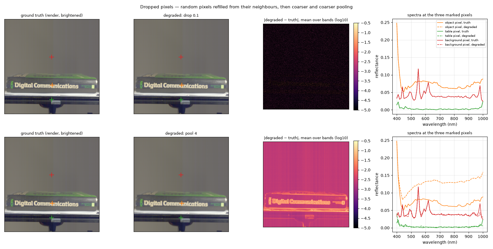
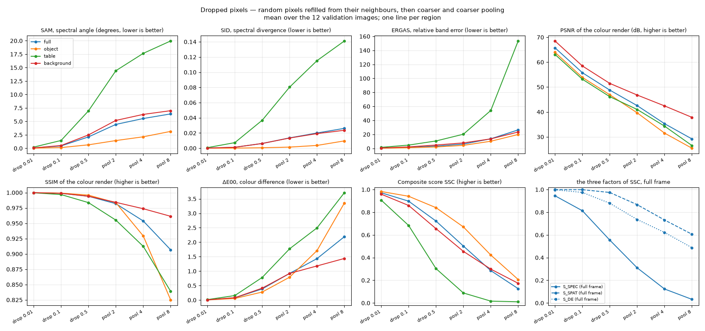

# Dropped pixels and pooling — how much does spatial detail matter?

Plan label: M1.

## In one sentence

We throw away some of the picture's spatial detail — first a few scattered
pixels, then whole blocks — and ask how the score reacts.

## What we do, simply

Think of the true cube as a mosaic of one million tiles (1024 × 1024), each
tile holding a 61-number spectrum. In the first three settings we pick
tiles at random — 1 in 100, then 1 in 10, then 1 in 2 — pull them out, and
put back a tile that is simply the average of the four tiles around it. The
picture looks identical to the eye; only the tiles we replaced are slightly
"smoothed".

In the next three settings we do something coarser: we shrink the whole
picture to half, a quarter and an eighth of its size by averaging blocks of
2 × 2, 4 × 4 and 8 × 8 tiles, then stretch it back up to full size with
smooth (bilinear) interpolation. This is what a model that works at a lower
resolution and upsamples its output would produce if it were otherwise
perfect.

## What it is meant to show

- How the score prices spatial resolution: a 2× pooled prediction is a
  natural "budget" answer, and we want its price tag.
- Whether a spatial edit is charged through the *spatial* metrics (PSNR,
  SSIM) or leaks into the *spectral* ones (SAM, SID, ERGAS). A refilled pixel
  gets the neighbours' mixed spectrum, so the spectral metrics may notice
  before the picture metrics do.
- An anchor for the August pooled-resolution ladder (512², 256², 128²
  ground truth upsampled back scored 0.535, 0.307, 0.136 full frame on a
  different image set).

## Exactly how

- "drop f": a random mask selects a fraction f of pixels (f = 0.01, 0.1,
  0.5, seed 0); each selected pixel's 61-vector is replaced by the mean of
  its four neighbours' 61-vectors, taken from the *original* cube (reflect
  padding at the border). Because the neighbours are original, even f = 0.5
  is a mild edit — by construction, not by accident.
- "pool p": average pooling with a p × p window (p = 2, 4, 8), then bilinear
  upsampling by p back to 1024 × 1024, band by band.

## Results

The example figure shows 1 pixel in 10 refilled (top) and 4× pooling
(bottom). At 1 in 10 the difference map is black except for isolated
specks, and the three spectra lie on top of each other. At 4× pooling the
difference map lights up exactly along the edges — the lettering on the
spine, the rim of the sheet, the clamp — and the object pixel's spectrum has
moved up bodily, because the marked pixel now contains a mix of the dark
spine and the bright letters around it.

Mean over the 12 validation images:

| setting | region | SAM ° | SID | ERGAS | PSNR dB | SSIM | ΔE00 | S_spec | S_spat | S_col | **SSC** |
|---|---|---|---|---|---|---|---|---|---|---|---|
| drop 0.01 | full | 0.06 | 0.0001 | 0.45 | 65.8 | 0.9999 | 0.01 | 0.945 | 1.000 | 0.997 | **0.972** |
| drop 0.01 | object | 0.02 | 0.0000 | 0.29 | 64.0 | 0.9999 | 0.01 | 0.966 | 1.000 | 0.998 | **0.983** |
| drop 0.01 | table | 0.22 | 0.0007 | 1.50 | 63.1 | 0.9997 | 0.02 | 0.824 | 1.000 | 0.995 | **0.907** |
| drop 0.01 | background | 0.07 | 0.0001 | 0.68 | 68.5 | 0.9999 | 0.01 | 0.921 | 1.000 | 0.997 | **0.959** |
| drop 0.1 | full | 0.44 | 0.0012 | 1.42 | 55.8 | 0.9988 | 0.08 | 0.813 | 0.999 | 0.975 | **0.898** |
| drop 0.1 | object | 0.13 | 0.0001 | 0.93 | 53.9 | 0.9992 | 0.06 | 0.893 | 0.996 | 0.982 | **0.941** |
| drop 0.1 | table | 1.46 | 0.0073 | 4.72 | 53.2 | 0.9968 | 0.16 | 0.475 | 0.998 | 0.949 | **0.684** |
| drop 0.1 | background | 0.51 | 0.0012 | 2.15 | 58.5 | 0.9988 | 0.08 | 0.746 | 0.999 | 0.973 | **0.860** |
| drop 0.5 | full | 2.12 | 0.0062 | 3.18 | 48.8 | 0.9940 | 0.38 | 0.555 | 0.974 | 0.880 | **0.722** |
| drop 0.5 | object | 0.65 | 0.0006 | 2.08 | 46.9 | 0.9959 | 0.28 | 0.757 | 0.945 | 0.912 | **0.840** |
| drop 0.5 | table | 6.96 | 0.0368 | 10.62 | 46.1 | 0.9836 | 0.78 | 0.105 | 0.928 | 0.770 | **0.303** |
| drop 0.5 | background | 2.49 | 0.0062 | 4.80 | 51.5 | 0.9941 | 0.41 | 0.449 | 0.997 | 0.872 | **0.656** |
| pool 2 | full | 4.44 | 0.0136 | 6.15 | 42.6 | 0.9819 | 0.92 | 0.310 | 0.867 | 0.736 | **0.502** |
| pool 2 | object | 1.44 | 0.0015 | 4.31 | 39.7 | 0.9835 | 0.79 | 0.564 | 0.819 | 0.771 | **0.671** |
| pool 2 | table | 14.43 | 0.0804 | 20.26 | 41.0 | 0.9551 | 1.77 | 0.011 | 0.828 | 0.554 | **0.088** |
| pool 2 | background | 5.18 | 0.0134 | 7.88 | 46.8 | 0.9841 | 0.92 | 0.238 | 0.939 | 0.736 | **0.455** |
| pool 4 | full | 5.54 | 0.0200 | 13.71 | 35.3 | 0.9537 | 1.43 | 0.123 | 0.732 | 0.622 | **0.286** |
| pool 4 | object | 2.14 | 0.0036 | 10.24 | 31.5 | 0.9293 | 1.71 | 0.294 | 0.657 | 0.574 | **0.423** |
| pool 4 | table | 17.65 | 0.1152 | 54.16 | 34.3 | 0.9123 | 2.50 | 0.000 | 0.695 | 0.435 | **0.017** |
| pool 4 | background | 6.30 | 0.0192 | 13.59 | 42.4 | 0.9737 | 1.18 | 0.115 | 0.861 | 0.675 | **0.299** |
| pool 8 | full | 6.40 | 0.0261 | 26.44 | 29.2 | 0.9067 | 2.19 | 0.032 | 0.606 | 0.488 | **0.127** |
| pool 8 | object | 3.14 | 0.0096 | 19.85 | 25.5 | 0.8250 | 3.36 | 0.104 | 0.503 | 0.347 | **0.207** |
| pool 8 | table | 19.96 | 0.1411 | 153.46 | 26.5 | 0.8390 | 3.71 | 0.000 | 0.528 | 0.290 | **0.011** |
| pool 8 | background | 6.99 | 0.0236 | 23.43 | 37.8 | 0.9614 | 1.44 | 0.047 | 0.778 | 0.621 | **0.174** |

## Reading

- **One refilled pixel in a hundred already costs 2 %** (object 0.983, full
  0.972). Nothing in the picture changed visibly, PSNR sits above 60 dB, SSIM
  is 0.9999 — and still the spectral part drops to 0.945 full frame, because
  each refilled pixel's spectrum is the neighbours' mix. The charge for a
  spatial edit arrives through the spectral metrics.
- **The table region pays first.** At 1 in 10 refilled pixels the object is
  at 0.94 and the table already at 0.68; at 2× pooling the table is at 0.09.
  The rail's spectra are tiny and noisy, so mixing neighbours changes their
  *shape* a lot even though the absolute change is minute.
- **Half the resolution is worth a third of the score** on the object
  (0.67) and half of it full frame (0.50). Our full-frame numbers for 2×, 4×,
  8× pooling (0.50, 0.29, 0.13) reproduce the August ladder (0.535, 0.307,
  0.136) on a different image set, so that anchor stands.
- **Even at 8× pooling the object's SAM is only 3°.** A model can be
  spatially blurry and still have a very good spectral angle; the score at
  that point is carried down mostly by ERGAS (19.9 on the object) and the
  picture metrics (PSNR 25.5 dB, SSIM 0.83).

## What to take from it

Spatial detail is priced steeply, and the bill is sent mostly to the
spectral metrics and to the dark rail. A model that predicts at half
resolution starts at 0.67 on the object even if everything else were
perfect.
