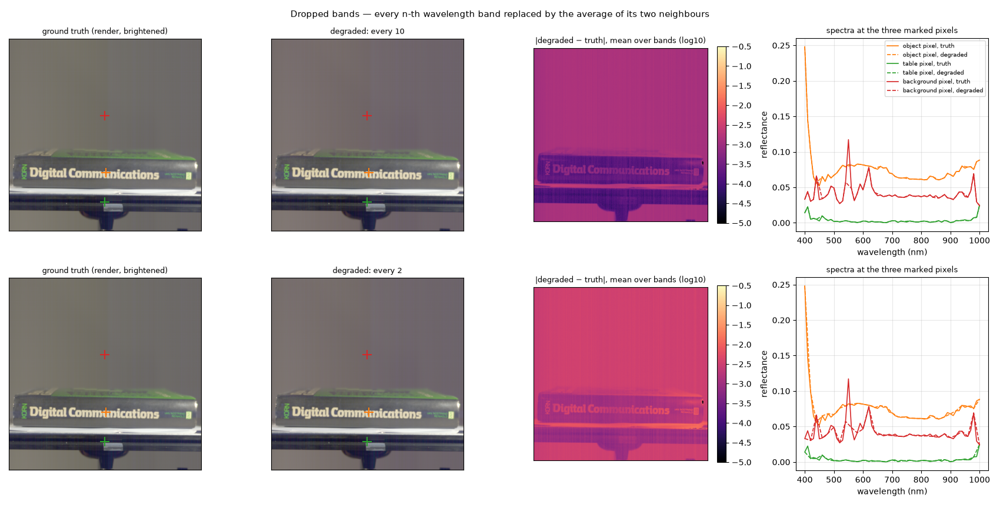
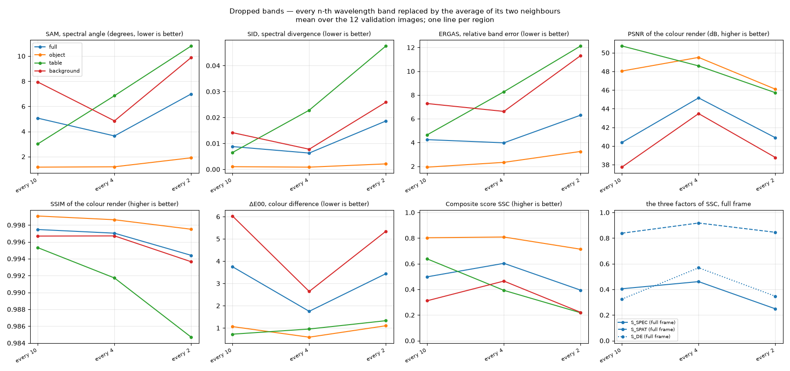

# Dropped wavelength bands — how much fine spectral structure matters

Plan label: M2.

## In one sentence

We erase some of the 61 wavelength bands and fill them in by drawing a
straight line between their neighbours, then ask how the score reacts.

## What we do, simply

A spectrum is a curve with 61 points, one every 10 nm. Suppose a model had
measured only every second point and simply connected the dots for the
others — a perfectly reasonable thing to do if you believe spectra are
smooth. We build exactly that: every 10th band, every 4th band, and every
2nd band is deleted and replaced by the average of its two surviving
neighbours (linear interpolation). Everything else is left untouched; the
pictures look identical.

## What it is meant to show

- Whether the scorer rewards *fine* spectral structure or whether a smooth
  curve through the right points is good enough.
- Which of the spectral metrics notices: SAM (shape), SID (shape near
  zero), ERGAS (per-band error).
- A price tag for the intuitive idea "predict fewer bands, interpolate the
  rest".

## Exactly how

- "every n": the dropped bands are indices n/2, n/2 + n, n/2 + 2n, … of the
  61 (so 400 nm and 1000 nm, the end bands, are always kept). every 10
  drops 6 bands (450, 550, …, 950 nm); every 4 drops 15 bands (420, 460,
  …, 980 nm); every 2 drops the 30 odd bands (410, 430, …, 990 nm).
- Each dropped band b is set to (1−w)·x[lo] + w·x[hi], with lo and hi the
  nearest kept bands below and above and w the fractional position.

## Results

The example figure shows every 10th band dropped (top) and every 2nd band
dropped (bottom). The renders are indistinguishable from the truth. The
spectra tell the story: the true curves are *not* smooth — the background
pixel (red) has sharp spikes at about 440, 550 and 620 nm, and the object
pixel (orange) a sharp rise at 400 nm. These are emission lines of the
lamp reflected by the grey wall, not properties of the objects. Wherever a
dropped band sits on one of those spikes, the straight line cuts the spike
off (dashed red at 550 nm in the top row), and that is a large relative
error at that band.

Mean over the 12 validation images:

| setting | region | SAM ° | SID | ERGAS | PSNR dB | SSIM | ΔE00 | S_spec | S_spat | S_col | **SSC** |
|---|---|---|---|---|---|---|---|---|---|---|---|
| every 10 | full | 5.06 | 0.0088 | 4.25 | 40.4 | 0.9975 | 3.75 | 0.405 | 0.838 | 0.324 | **0.498** |
| every 10 | object | 1.16 | 0.0010 | 1.93 | 48.0 | 0.9991 | 1.06 | 0.738 | 0.955 | 0.723 | **0.803** |
| every 10 | table | 3.01 | 0.0065 | 4.65 | 50.7 | 0.9953 | 0.72 | 0.438 | 0.998 | 0.786 | **0.638** |
| every 10 | background | 7.94 | 0.0142 | 7.28 | 37.7 | 0.9967 | 6.03 | 0.209 | 0.794 | 0.136 | **0.312** |
| every 4 | full | 3.65 | 0.0063 | 3.98 | 45.2 | 0.9970 | 1.75 | 0.461 | 0.918 | 0.569 | **0.603** |
| every 4 | object | 1.19 | 0.0008 | 2.34 | 49.5 | 0.9986 | 0.59 | 0.706 | 0.977 | 0.825 | **0.809** |
| every 4 | table | 6.85 | 0.0228 | 8.28 | 48.6 | 0.9917 | 0.95 | 0.173 | 0.972 | 0.728 | **0.393** |
| every 4 | background | 4.85 | 0.0078 | 6.62 | 43.5 | 0.9967 | 2.64 | 0.306 | 0.890 | 0.415 | **0.465** |
| every 2 | full | 6.99 | 0.0186 | 6.31 | 40.9 | 0.9944 | 3.44 | 0.249 | 0.845 | 0.347 | **0.394** |
| every 2 | object | 1.91 | 0.0021 | 3.25 | 46.1 | 0.9975 | 1.10 | 0.597 | 0.932 | 0.708 | **0.714** |
| every 2 | table | 10.81 | 0.0476 | 12.13 | 45.7 | 0.9847 | 1.33 | 0.058 | 0.921 | 0.642 | **0.218** |
| every 2 | background | 9.89 | 0.0259 | 11.32 | 38.8 | 0.9936 | 5.34 | 0.097 | 0.810 | 0.170 | **0.221** |

## Reading

- **On the object, connecting the dots is cheap:** 0.80 with 6 bands
  dropped, 0.81 with 15, 0.71 with 30. The object spectra are smooth
  enough that interpolation across 20 nm is nearly free; across 40 nm
  (every 2nd band) SAM rises to 1.9° and the score to 0.71.
- **The sweep is not monotonic in the number of bands.** Dropping every
  10th band (6 bands) costs *more* on the full frame (0.50) than dropping
  every 4th (15 bands, 0.60). The reason is *which* bands: the every-10
  pattern deletes 550 nm, the strongest lamp line, and the background's
  colour render changes (ΔE00 6.0 on the background, PSNR 37.7 dB) even
  though the object is untouched. The knob here is "which bands", not "how
  many".
- **The background and the table carry the loss.** For every 2nd band
  dropped: object 0.71, background 0.22, table 0.22, full frame 0.39. The
  background's grey wall shows the lamp's line spectrum almost purely, so
  it is the most "spiky" region and suffers most from smoothing across
  bands.
- **SID and ERGAS stay small** (object SID ≤ 0.002, ERGAS ≤ 3.3): the
  interpolation keeps the spectrum's overall shape and level; what moves the
  score is SAM plus the colour metrics on the spiky regions.

## What to take from it

Fine spectral structure matters where the spectrum is *not* the object's
but the lamp's: the sharp emission lines in the background and on the rail.
A model that predicts smooth spectra pays there, not on the object. For the
paper, the fair statement is that band-level detail is priced through the
lamp lines, and the full-frame score is again decided by the non-object
regions.
