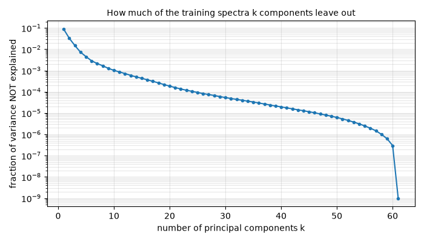
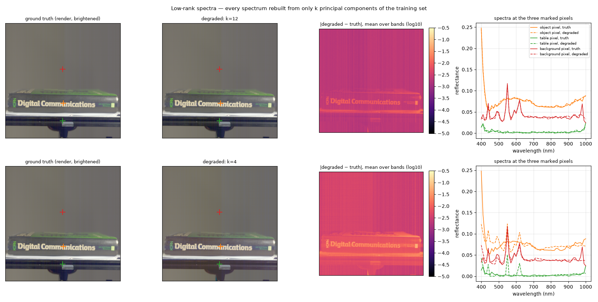
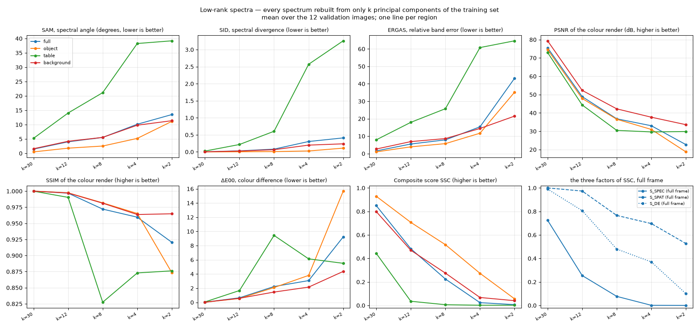

# Low-rank spectra — how much does a perfect "compressed" answer score?

Plan label: M3.

## In one sentence

We rebuild every spectrum from only its k most important ingredients,
learned from the training set, and ask how the score reacts as k shrinks.

## What we do, simply

Real reflectance spectra are highly redundant: most of them can be written
as "a bit of this shape, a bit of that shape", using a handful of basic
shapes. Statistics has a tool to find those basic shapes — principal
component analysis (PCA). We compute the basic shapes from the training
images and then rewrite every spectrum of the validation images using only
the k most important ones: 30, 12, 8, 4, 2. With k = 61 the copy would be
exact; with k = 2 every spectrum becomes a blend of just two curves.

This is a stand-in for a model that has learned the *typical* spectra
perfectly but cannot represent anything beyond them. "Explains 99.3 % of the
variance" is the usual way such compression is praised; we ask what the
score thinks of it.

## What it is meant to show

- What a perfect predictor that knows only the low-dimensional structure of
  the data is worth.
- Whether the score is sensitive to the tiny residual (the last 0.1 % of
  variance), which is exactly where sensor noise and the stripes live.
- Whether SID/SAM or ERGAS notice first.

## Exactly how

- Mean spectrum and 61 × 61 covariance are accumulated in float64 from
  every 8th row of all 165 training cubes; the eigenvectors of the
  covariance, in descending eigenvalue order, are the basis.
- Cumulative variance explained: k = 2 → 96.73 %, 4 → 99.27 %, 8 → 99.83 %,
  12 → 99.93 %, 30 → 99.995 %.
- Each spectrum x is replaced by mean + Bₖ Bₖᵀ (x − mean), Bₖ the first k
  eigenvectors; negative values are clipped at 0.

## Results

At k = 12 (top) the difference map is faint everywhere and the spectra
overlap except at the sharpest features. At k = 4 (bottom) the spectra are
visibly wrong: the object's flat middle has gained a lump at 550 nm, the
table pixel has grown spikes that were never there (dashed green), because
with four ingredients the only way to draw a small flat spectrum is to mix
in a bit of the lamp-line shape.

Mean over the 12 validation images:

| setting | region | SAM ° | SID | ERGAS | PSNR dB | SSIM | ΔE00 | S_spec | S_spat | S_col | **SSC** |
|---|---|---|---|---|---|---|---|---|---|---|---|
| k=30 | full | 1.46 | 0.0034 | 1.53 | 75.5 | 1.0000 | 0.03 | 0.725 | 1.000 | 0.990 | **0.850** |
| k=30 | object | 0.50 | 0.0002 | 0.98 | 74.6 | 1.0000 | 0.02 | 0.866 | 1.000 | 0.992 | **0.929** |
| k=30 | table | 5.22 | 0.0238 | 7.89 | 73.0 | 1.0000 | 0.06 | 0.198 | 1.000 | 0.980 | **0.443** |
| k=30 | background | 1.60 | 0.0029 | 2.62 | 79.4 | 1.0000 | 0.03 | 0.640 | 1.000 | 0.991 | **0.799** |
| k=12 | full | 4.01 | 0.0302 | 5.50 | 48.9 | 0.9969 | 0.65 | 0.254 | 0.974 | 0.807 | **0.483** |
| k=12 | object | 1.79 | 0.0037 | 3.88 | 47.9 | 0.9974 | 0.55 | 0.550 | 0.949 | 0.833 | **0.707** |
| k=12 | table | 14.04 | 0.2169 | 17.93 | 44.3 | 0.9903 | 1.67 | 0.002 | 0.901 | 0.573 | **0.035** |
| k=12 | background | 4.19 | 0.0251 | 6.88 | 52.3 | 0.9971 | 0.58 | 0.236 | 0.997 | 0.825 | **0.470** |
| k=8 | full | 5.54 | 0.0808 | 7.88 | 36.8 | 0.9721 | 2.23 | 0.077 | 0.766 | 0.480 | **0.225** |
| k=8 | object | 2.54 | 0.0097 | 5.72 | 36.5 | 0.9818 | 2.09 | 0.396 | 0.767 | 0.528 | **0.517** |
| k=8 | table | 21.14 | 0.6050 | 25.74 | 30.5 | 0.8275 | 9.44 | 0.000 | 0.588 | 0.043 | **0.006** |
| k=8 | background | 5.55 | 0.0646 | 8.62 | 42.2 | 0.9813 | 1.46 | 0.101 | 0.861 | 0.618 | **0.275** |
| k=4 | full | 10.12 | 0.3046 | 15.34 | 33.0 | 0.9596 | 3.07 | 0.001 | 0.697 | 0.370 | **0.024** |
| k=4 | object | 5.20 | 0.0270 | 11.69 | 31.0 | 0.9653 | 3.80 | 0.151 | 0.666 | 0.314 | **0.274** |
| k=4 | table | 38.27 | 2.5700 | 60.77 | 29.6 | 0.8730 | 6.13 | 0.000 | 0.597 | 0.130 | **0.002** |
| k=4 | background | 9.80 | 0.1989 | 14.40 | 37.7 | 0.9637 | 2.15 | 0.008 | 0.776 | 0.489 | **0.068** |
| k=2 | full | 13.50 | 0.4106 | 43.16 | 22.7 | 0.9205 | 9.22 | 0.000 | 0.527 | 0.100 | **0.007** |
| k=2 | object | 11.13 | 0.1108 | 35.19 | 18.7 | 0.8734 | 15.67 | 0.024 | 0.472 | 0.040 | **0.056** |
| k=2 | table | 39.20 | 3.2585 | 64.65 | 29.8 | 0.8762 | 5.51 | 0.000 | 0.602 | 0.160 | **0.002** |
| k=2 | background | 11.36 | 0.2366 | 21.49 | 33.6 | 0.9649 | 4.36 | 0.004 | 0.709 | 0.243 | **0.040** |

## Reading

- **"99.3 % of the variance" scores 0.27 on the object and 0.02 full
  frame** (k = 4). The residual 0.7 % *is* the score. A model that learns
  four spectral "colours" and predicts them perfectly is nearly worthless
  under this metric.
- **Even 30 components cost 7 % on the object** (0.93) and 15 % full frame
  (0.85). The last 31 components hold 0.005 % of the variance. The score is
  sensitive to detail at the level of the sensor's own noise — which is the
  same detail the stripes and the noise study are about.
- **The table region is destroyed at k = 12** (0.035) while the object is
  still at 0.71. The rail's spectra are tiny, so the *relative* error of any
  reconstruction is enormous there.
- **SID reacts first on the full frame.** At k = 12 the full-frame SID is
  0.030 (S_SID = 0.22) while SAM is 4.0° (S_SAM = 0.45): the logarithmic
  metric punishes the near-zero reconstructions of the dark pixels before the
  angle does.

## What to take from it

A perfect low-dimensional model of the data is not a good model under this
score. The score rewards the part of the spectrum that is essentially noise,
which means two things for training: it pays to reproduce the noise-level
detail, and the room to do that is not in the object but in the dark
regions.
