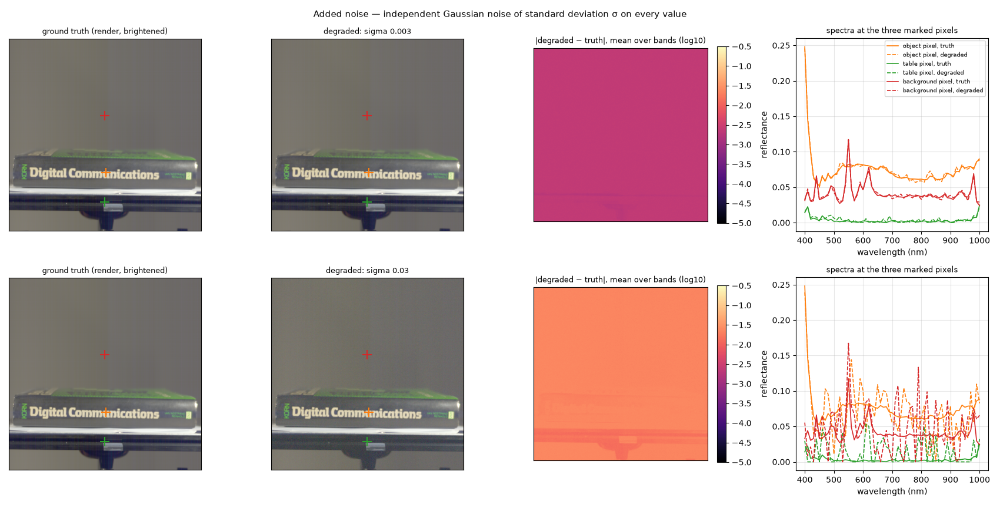
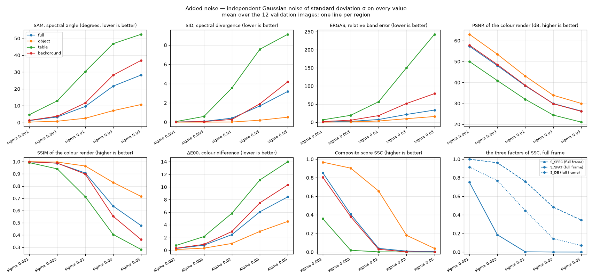
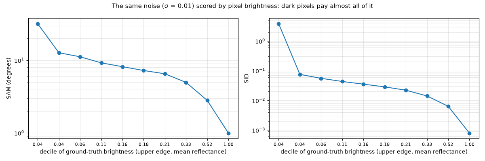

# Added noise — the dark-pixel mechanism

Plan label: M4.

## In one sentence

We sprinkle a little random noise, the same amount everywhere, on a perfect
answer and watch where the score loses it.

## What we do, simply

Take the true cube and add to every one of its 64 million values a small
random number drawn from a bell curve of width σ. With σ = 0.001 the noise
is one thousandth of full reflectance — you would never see it. We go up to
σ = 0.05, which is visible grain. The noise is *the same size everywhere*:
on the bright paper sheet, on the object, and on the almost-black rail.

That last point is the whole experiment. A bright pixel reflects 0.5; the
rail reflects 0.002. Noise of 0.003 is a rounding error on the sheet and a
150 % error on the rail. The scorer's shape metrics, SAM and SID, compare
*relative* shapes, so they see the rail's noise as a catastrophe and the
sheet's as nothing.

## What it is meant to show

- The brightness dependence of the score: the same absolute error, priced
  by pixel brightness.
- The size of noise that corresponds to leaderboard-level scores — a ruler.
- Which regions carry the full-frame score.

## Exactly how

- x + σ·N(0, 1), independent per value, σ ∈ {0.001, 0.003, 0.01, 0.03,
  0.05}, seed 0; clipped at 0 afterwards (SID needs non-negative spectra).
- The by-brightness view: at σ = 0.01, every pixel of every validation image
  is binned into ten deciles of its ground-truth brightness (mean reflectance
  over the 61 bands), and SAM and SID are averaged per decile.

## Results

At σ = 0.003 (top) the renders are identical and the difference map is a
flat colour: the noise is uniform. Look at the spectra: the object pixel's
dashed curve wobbles slightly around the solid one, the table pixel's dashed
curve is *all* wobble — its true spectrum is 0.002 and the noise is 0.003.
At σ = 0.03 (bottom) even the object's spectrum is a jagged mess, and the
rail's is pure noise.

Mean over the 12 validation images:

| setting | region | SAM ° | SID | ERGAS | PSNR dB | SSIM | ΔE00 | S_spec | S_spat | S_col | **SSC** |
|---|---|---|---|---|---|---|---|---|---|---|---|
| sigma 0.001 | full | 1.14 | 0.0076 | 0.76 | 57.3 | 0.9984 | 0.27 | 0.751 | 0.999 | 0.915 | **0.855** |
| sigma 0.001 | object | 0.26 | 0.0001 | 0.33 | 63.0 | 0.9996 | 0.11 | 0.947 | 1.000 | 0.965 | **0.968** |
| sigma 0.001 | table | 4.65 | 0.0567 | 6.54 | 50.0 | 0.9921 | 0.75 | 0.142 | 0.995 | 0.780 | **0.360** |
| sigma 0.001 | background | 1.29 | 0.0066 | 1.84 | 57.8 | 0.9985 | 0.31 | 0.670 | 0.999 | 0.901 | **0.806** |
| sigma 0.003 | full | 3.30 | 0.0737 | 2.27 | 48.1 | 0.9873 | 0.79 | 0.186 | 0.961 | 0.769 | **0.407** |
| sigma 0.003 | object | 0.77 | 0.0006 | 0.99 | 53.5 | 0.9963 | 0.32 | 0.845 | 0.998 | 0.899 | **0.904** |
| sigma 0.003 | table | 12.89 | 0.5882 | 19.07 | 40.9 | 0.9408 | 2.16 | 0.001 | 0.819 | 0.487 | **0.019** |
| sigma 0.003 | background | 3.76 | 0.0588 | 5.51 | 48.6 | 0.9877 | 0.93 | 0.167 | 0.970 | 0.735 | **0.381** |
| sigma 0.01 | full | 9.56 | 0.4111 | 7.49 | 38.4 | 0.9074 | 2.47 | 0.003 | 0.760 | 0.446 | **0.040** |
| sigma 0.01 | object | 2.53 | 0.0094 | 3.30 | 43.0 | 0.9647 | 1.07 | 0.541 | 0.866 | 0.710 | **0.657** |
| sigma 0.01 | table | 30.26 | 3.5452 | 56.54 | 32.0 | 0.7138 | 5.85 | 0.000 | 0.556 | 0.143 | **0.002** |
| sigma 0.01 | background | 11.59 | 0.2750 | 18.28 | 38.6 | 0.8986 | 2.96 | 0.001 | 0.760 | 0.373 | **0.030** |
| sigma 0.03 | full | 21.64 | 1.6792 | 21.44 | 29.9 | 0.6367 | 6.07 | 0.000 | 0.484 | 0.145 | **0.010** |
| sigma 0.03 | object | 7.06 | 0.1944 | 9.72 | 33.9 | 0.8299 | 2.97 | 0.071 | 0.646 | 0.397 | **0.180** |
| sigma 0.03 | table | 46.87 | 7.5646 | 150.53 | 24.4 | 0.4047 | 11.12 | 0.000 | 0.276 | 0.025 | **0.001** |
| sigma 0.03 | background | 28.19 | 1.9002 | 51.69 | 29.8 | 0.5534 | 7.50 | 0.000 | 0.440 | 0.082 | **0.002** |
| sigma 0.05 | full | 28.24 | 3.1872 | 33.57 | 26.3 | 0.4771 | 8.44 | 0.000 | 0.344 | 0.071 | **0.004** |
| sigma 0.05 | object | 10.70 | 0.5099 | 15.75 | 30.0 | 0.7154 | 4.56 | 0.007 | 0.524 | 0.245 | **0.039** |
| sigma 0.05 | table | 52.46 | 9.1210 | 242.86 | 21.1 | 0.2817 | 14.00 | 0.000 | 0.159 | 0.009 | **0.000** |
| sigma 0.05 | background | 36.95 | 4.1881 | 78.97 | 26.2 | 0.3629 | 10.34 | 0.000 | 0.285 | 0.032 | **0.001** |

The same noise scored by pixel brightness (σ = 0.01, mean over the 12
images; the x-axis labels are the upper edge of each decile of mean
reflectance):

| decile | mean reflectance (from – to) | SAM ° | SID |
|---|---|---|---|
| 1 | 0.002 – 0.037 | 31.88 | 3.8297 |
| 2 | 0.037 – 0.045 | 12.70 | 0.0752 |
| 3 | 0.045 – 0.059 | 11.16 | 0.0553 |
| 4 | 0.059 – 0.112 | 9.21 | 0.0433 |
| 5 | 0.112 – 0.156 | 8.15 | 0.0352 |
| 6 | 0.156 – 0.176 | 7.22 | 0.0285 |
| 7 | 0.176 – 0.208 | 6.51 | 0.0220 |
| 8 | 0.208 – 0.335 | 4.95 | 0.0141 |
| 9 | 0.335 – 0.521 | 2.80 | 0.0063 |
| 10 | 0.521 – 0.998 | 0.99 | 0.0008 |

## Reading

- **0.3 % noise: object 0.90, full frame 0.41, table 0.02.** A prediction
  that is essentially perfect on the object, with an error smaller than
  anything a person could see, has already lost 60 % of its full-frame
  score — all of it in the dark regions.
- **1 % noise: object 0.66, full frame 0.04.** The full-frame score is at
  the floor. Per image the full-frame score ranges only from 0.024 to
  0.058; the object score ranges from 0.26 to 0.78 depending on how bright
  the object is.
- **The dark decile pays 30× the bright decile.** At σ = 0.01 the darkest
  tenth of the pixels (mean reflectance below 0.037) has SAM 32° and SID
  3.8; the brightest tenth has SAM 1.0° and SID 0.0008. Both metrics fall
  smoothly with brightness in between: the dependence is not a threshold
  effect, it is the 1/brightness of a relative measure.
- **SID is the sharper edge.** From σ = 0.003 to 0.01 the full-frame S_SID
  goes from 0.025 to 0.000 while S_SAM goes from 0.52 to 0.15. SID's
  logarithms on near-zero values are the first thing to give.
- **The colour and picture metrics barely move** until σ = 0.03 (full frame
  PSNR 29.9 dB, SSIM 0.64, ΔE00 6.1): a picture can look fine while the
  spectral part of the score is already zero.

## What to take from it

This is the central mechanism of the whole study. The full-frame score is a
measurement of the *darkest* pixels of the frame, and those are the table
rail and the background, not the object. Any comparison between models on
the full frame is mostly a comparison of how they reproduce the noise of
the rail. Reading per region is not a nicety; it is the only way to see the
object.
