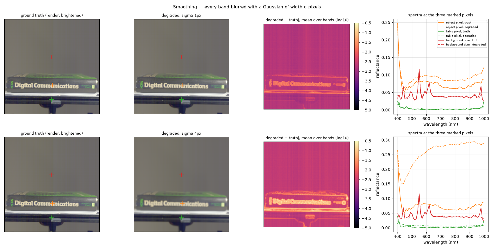
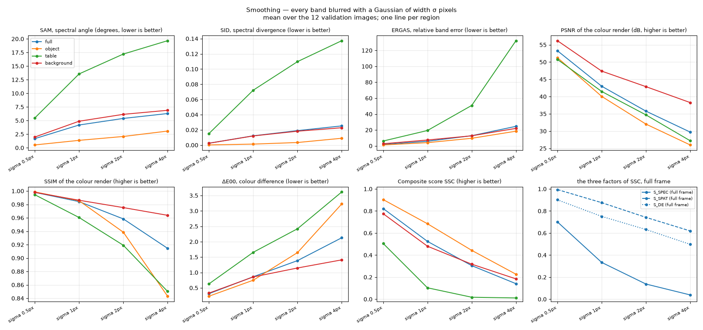

# Spatial smoothing — is a cleaner-than-truth prediction punished?

Plan label: M5.

## In one sentence

We blur every band a little, as a denoising model would, and ask whether
the scorer rewards or punishes a prediction that is smoother than the
truth.

## What we do, simply

Models trained with a mean-error loss tend to output smooth, slightly
blurry answers: they average over what they are unsure of. Here we do the
blurring by hand. Every one of the 61 band images is convolved with a
Gaussian of width σ = 0.5, 1, 2 and 4 pixels. At σ = 0.5 the blur is below a
pixel and invisible; at σ = 4 the lettering on the spine is soft.

The ground truth itself contains fine, high-contrast structure: the
vertical stripes (one column wide) and the sensor's pixel noise. A blur
removes exactly those. So this experiment also asks: does the scorer want
the stripes and the noise back?

## What it is meant to show

- The price of over-smoothing, the most common failure mode of regression
  models.
- How this price compares with pooling (the previous file): σ ≈ 1 px should
  resemble 2× pooling.
- Whether the "cleaner" answer is charged through the spectral metrics
  (because the stripes are a per-band pattern) or the picture ones.

## Exactly how

- Separable Gaussian blur per band, kernel radius 3σ, reflect padding;
  σ ∈ {0.5, 1, 2, 4} pixels.

## Results

At σ = 1 px (top) the render is barely softer, but the difference map
shows the whole frame lit up faintly and evenly — the stripes and pixel
noise that the blur removed, everywhere — with the edges brighter on top.
At σ = 4 px (bottom) the edges dominate and the object pixel's spectrum has
drifted, as at 4× pooling, because the pixel now averages the dark spine
with its bright neighbours.

Mean over the 12 validation images:

| setting | region | SAM ° | SID | ERGAS | PSNR dB | SSIM | ΔE00 | S_spec | S_spat | S_col | **SSC** |
|---|---|---|---|---|---|---|---|---|---|---|---|
| sigma 0.5px | full | 1.68 | 0.0025 | 1.85 | 53.3 | 0.9980 | 0.31 | 0.701 | 0.994 | 0.901 | **0.822** |
| sigma 0.5px | object | 0.52 | 0.0002 | 1.22 | 51.3 | 0.9986 | 0.23 | 0.842 | 0.988 | 0.926 | **0.903** |
| sigma 0.5px | table | 5.48 | 0.0153 | 6.15 | 50.8 | 0.9944 | 0.63 | 0.272 | 0.997 | 0.810 | **0.505** |
| sigma 0.5px | background | 1.97 | 0.0024 | 2.74 | 56.2 | 0.9980 | 0.33 | 0.622 | 0.999 | 0.895 | **0.775** |
| sigma 1px | full | 4.18 | 0.0122 | 5.82 | 43.0 | 0.9842 | 0.86 | 0.334 | 0.875 | 0.751 | **0.524** |
| sigma 1px | object | 1.36 | 0.0013 | 4.09 | 40.1 | 0.9855 | 0.75 | 0.580 | 0.827 | 0.781 | **0.684** |
| sigma 1px | table | 13.56 | 0.0722 | 19.36 | 41.5 | 0.9605 | 1.66 | 0.014 | 0.838 | 0.576 | **0.103** |
| sigma 1px | background | 4.87 | 0.0120 | 7.42 | 47.4 | 0.9862 | 0.86 | 0.262 | 0.949 | 0.752 | **0.480** |
| sigma 2px | full | 5.39 | 0.0190 | 12.84 | 35.8 | 0.9584 | 1.39 | 0.138 | 0.742 | 0.632 | **0.304** |
| sigma 2px | object | 2.07 | 0.0034 | 9.57 | 32.0 | 0.9386 | 1.65 | 0.315 | 0.670 | 0.586 | **0.443** |
| sigma 2px | table | 17.21 | 0.1098 | 50.85 | 34.7 | 0.9191 | 2.42 | 0.001 | 0.704 | 0.446 | **0.018** |
| sigma 2px | background | 6.14 | 0.0183 | 12.70 | 42.9 | 0.9753 | 1.15 | 0.128 | 0.869 | 0.683 | **0.318** |
| sigma 4px | full | 6.28 | 0.0252 | 24.59 | 29.7 | 0.9145 | 2.13 | 0.039 | 0.619 | 0.498 | **0.141** |
| sigma 4px | object | 3.06 | 0.0090 | 18.48 | 26.0 | 0.8431 | 3.23 | 0.118 | 0.521 | 0.361 | **0.226** |
| sigma 4px | table | 19.66 | 0.1373 | 132.21 | 27.2 | 0.8503 | 3.62 | 0.000 | 0.545 | 0.300 | **0.011** |
| sigma 4px | background | 6.88 | 0.0228 | 22.04 | 38.3 | 0.9637 | 1.41 | 0.051 | 0.786 | 0.627 | **0.184** |

## Reading

- **A sub-pixel blur (σ = 0.5 px) costs 10 % on the object** (0.90) and 18 %
  full frame (0.82). Nothing changed in the picture (PSNR 51–53 dB, SSIM
  0.998); the loss is spectral (full-frame S_spec 0.70) and comes from the
  stripes and noise that the blur erased. The scorer wants them back.
- **σ = 1 px is 2× pooling:** object 0.68 vs 0.67, full frame 0.52 vs 0.50.
  The two spatial degradations are interchangeable rulers.
- **The rail dies first**, as always: 0.51 at σ = 0.5 px, 0.10 at 1 px.
- **At σ = 4 px the picture metrics take over** (object PSNR 26 dB, SSIM
  0.84, ΔE00 3.2): by then the blur is visible and the spatial and colour
  factors carry the loss together with ERGAS.

## What to take from it

Being cleaner than the truth is punished, and the punishment starts below
one pixel. Together with the destriping result this says that the
high-frequency content of the ground truth — the stripes and the noise — is
something the score demands, not something a model should suppress.
