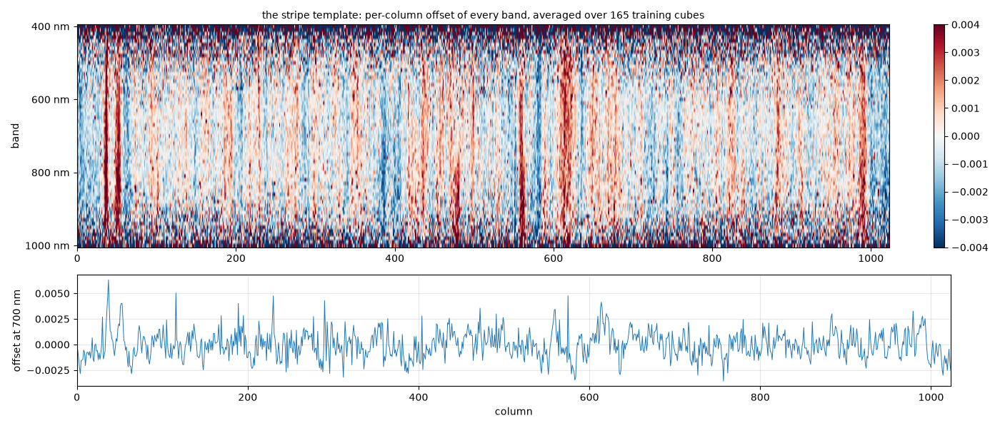
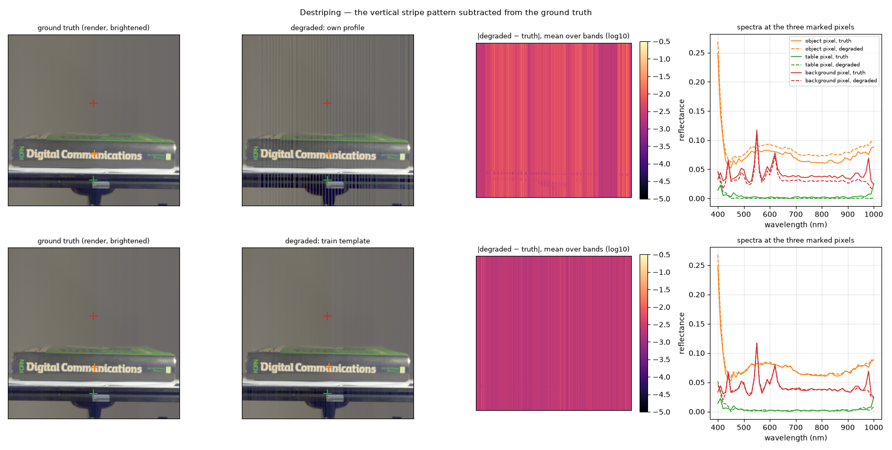
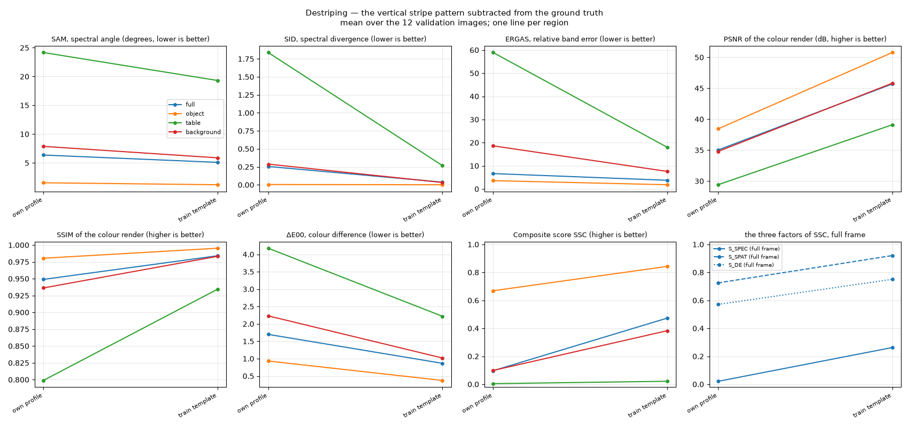

# Destriping — what is a perfect answer without the stripes worth?

Plan label: M6.

## In one sentence

We subtract the vertical stripe pattern from the ground truth and score the
result: this is the best a model can do if it never learns the stripes.

## What we do, simply

Every ground-truth cube in this dataset has faint vertical stripes: some
columns of the sensor read a little high, some a little low, in every image
and in the same places. You can see them in the difference maps of the
smoothing experiment and in the template figure below. They are not part of
the objects; they are part of the camera.

The question behind this experiment is whether the stripes are *static* —
the same in every image — and what they are worth to the score. If they are
static, a model can in principle memorise them, and the long training runs
may be doing exactly that. We test it two ways:

1. **own profile**: for one image, take each column's average over all rows
   (per band), keep only the fine, column-to-column part of that average
   (high-pass across columns), and subtract it from every row. This removes
   the image's own stripes — but it also removes any real vertical edge
   that happens to be present in most rows, so it over-corrects.
2. **train template**: average the column profiles of all 165 training
   cubes first, then high-pass. Objects sit at different places in different
   images and average out; what survives is the pattern that is common to
   the whole dataset. Subtract that from the validation image.

If the stripes are static, the template removes almost as much of the
"error" as the own profile does, without the over-correction.

## What it is meant to show

- Whether the stripe pattern is a dataset constant (the premise of the
  memorisation hypothesis H1).
- The score ceiling of any model that predicts the scene but not the
  camera's fixed pattern.
- How much of the full-frame score is stripes.

## Exactly how

- Column profile: mean over rows, giving a (1024 columns × 61 bands) array.
  High-pass: profile minus its Gaussian smoothing across columns with
  σ = 8 columns, reflect padding. The template is that high-pass of the
  mean profile over the training set (every 8th row of every cube).
- Degraded cube = ground truth − pattern (the same pattern on every row),
  clipped at 0.

The template: per-column offsets of ±0.003 reflectance, with a handful of
columns (near 40, 50, 390, 560, 610, 990) that are consistently off across
the whole 500–900 nm range — genuine bad columns — on top of a fine texture
that changes from band to band. The one-band cut at 700 nm shows the
amplitude: about the same size as the rail's entire reflectance.

## Results

The top row (own profile) shows the over-correction: the book's edges leak
into the column average and come back as vertical banding across the whole
render. The bottom row (train template) is clean: the difference map is a
faint, uniform vertical texture — just the stripes — and the spectra of all
three pixels are unchanged to the eye. That is the honest version of the
experiment; the own-profile row is kept as an upper bound.

Mean over the 12 validation images:

| setting | region | SAM ° | SID | ERGAS | PSNR dB | SSIM | ΔE00 | S_spec | S_spat | S_col | **SSC** |
|---|---|---|---|---|---|---|---|---|---|---|---|
| own profile | full | 6.36 | 0.2550 | 6.65 | 35.0 | 0.9489 | 1.70 | 0.021 | 0.725 | 0.571 | **0.097** |
| own profile | object | 1.54 | 0.0045 | 3.59 | 38.4 | 0.9804 | 0.93 | 0.578 | 0.797 | 0.737 | **0.669** |
| own profile | table | 24.17 | 1.8382 | 58.93 | 29.4 | 0.7988 | 4.18 | 0.000 | 0.556 | 0.268 | **0.004** |
| own profile | background | 7.87 | 0.2876 | 18.62 | 34.8 | 0.9362 | 2.23 | 0.023 | 0.714 | 0.506 | **0.099** |
| train template | full | 5.09 | 0.0370 | 3.75 | 45.7 | 0.9841 | 0.87 | 0.263 | 0.920 | 0.750 | **0.473** |
| train template | object | 1.20 | 0.0012 | 1.82 | 50.8 | 0.9953 | 0.37 | 0.744 | 0.990 | 0.884 | **0.843** |
| train template | table | 19.31 | 0.2670 | 17.97 | 39.1 | 0.9344 | 2.22 | 0.001 | 0.785 | 0.478 | **0.021** |
| train template | background | 5.87 | 0.0321 | 7.58 | 45.8 | 0.9833 | 1.02 | 0.173 | 0.922 | 0.712 | **0.383** |

## Reading

- **The stripes are static.** Subtracting a pattern computed from *other*
  images (the template) changes the validation cubes by almost as much as
  their own profiles do on the object (SAM 1.20° vs 1.54°), and does so
  without the edge artefacts. What the template removes is common to the
  dataset.
- **A perfect prediction without the stripes scores 0.84 on the object and
  0.47 full frame.** The rail goes to 0.02: its reflectance (~0.002) is
  about the size of the stripe amplitude (~0.003), so on the rail the
  stripes *are* the signal. Roughly half of the full-frame score of a
  perfect scene prediction is the camera's fixed pattern.
- **The object cost (16 %) is spectral**, not visual: object PSNR 50.8 dB
  and SSIM 0.995 stay excellent; SAM 1.2° and ERGAS 1.8 carry the loss.
- The own-profile variant (0.67 object, 0.10 full) overstates the loss
  because of the edge leakage visible in the figure; it is an upper bound.

## What to take from it

For the memorisation hypothesis this is the strongest model-free evidence
we have: there is a dataset-wide fixed pattern worth about half the
full-frame score and a sixth of the object score, and it is learnable in
principle because it is the same everywhere. Whether the baseline actually
learns it over 1000 epochs is a training question (the stripe probe on the
long reference run); this experiment says the prize exists.
