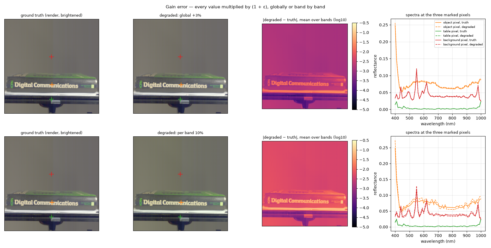
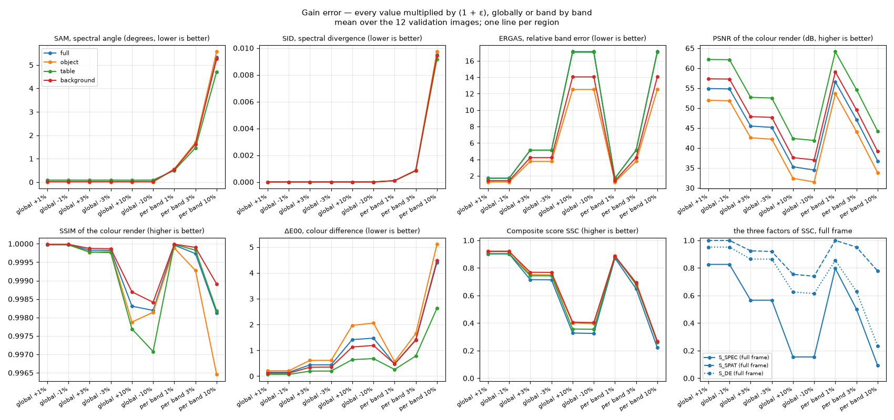

# Gain error — what a brightness mistake costs

Plan label: M7.

## In one sentence

We make the whole answer a few percent too bright or too dark, with the
spectral shapes exactly right, and see which metrics complain.

## What we do, simply

Multiply every value of the true cube by 1.03: the prediction is 3 % too
bright everywhere, but every spectrum has exactly the right shape, every
edge is in place, every colour ratio is preserved. This is the mistake a
model makes when it mis-estimates exposure or the white level — a global
gain. We try ±1 %, ±3 % and ±10 %.

Then a variant: each of the 61 bands gets its own gain, randomly +ε or −ε.
Now the spectral *shape* is slightly wrong too, in a fixed way across the
whole image — the mistake of a model with a slightly wrong per-band
calibration.

## What it is meant to show

- Which metrics see a scale error at all. SAM (angle) and SID (normalised
  shape) are blind to a global gain by construction; ERGAS, PSNR and ΔE00
  are not.
- The price of an exposure error that would be within normal lighting
  variation between shots.
- How a per-band error differs from a global one.

## Exactly how

- global: x · (1 + ε), ε ∈ {+0.01, −0.01, +0.03, −0.03, +0.10, −0.10}.
- per band: x · (1 + ε·s_b) with s_b ∈ {−1, +1} fixed random signs per band
  (seed 0), ε ∈ {0.01, 0.03, 0.10}.

## Results

At +3 % global (top) the render is indistinguishable, the difference map is
the image itself (the error is proportional to brightness), and the dashed
spectra sit a hair above the solid ones with identical shapes. At 10 % per
band (bottom) the dashed spectra are zig-zags around the truth: alternate
bands up and down.

Mean over the 12 validation images:

| setting | region | SAM ° | SID | ERGAS | PSNR dB | SSIM | ΔE00 | S_spec | S_spat | S_col | **SSC** |
|---|---|---|---|---|---|---|---|---|---|---|---|
| global +1% | full | 0.02 | 0.0000 | 1.71 | 54.9 | 1.0000 | 0.15 | 0.826 | 1.000 | 0.952 | **0.902** |
| global +1% | object | 0.01 | 0.0000 | 1.25 | 51.9 | 1.0000 | 0.21 | 0.870 | 1.000 | 0.933 | **0.923** |
| global +1% | table | 0.09 | 0.0000 | 1.70 | 62.2 | 1.0000 | 0.07 | 0.823 | 1.000 | 0.978 | **0.904** |
| global +1% | background | 0.02 | 0.0000 | 1.40 | 57.3 | 1.0000 | 0.12 | 0.855 | 1.000 | 0.962 | **0.919** |
| global -1% | full | 0.02 | 0.0000 | 1.71 | 54.8 | 1.0000 | 0.15 | 0.826 | 1.000 | 0.952 | **0.902** |
| global -1% | object | 0.01 | 0.0000 | 1.25 | 51.8 | 1.0000 | 0.21 | 0.870 | 1.000 | 0.933 | **0.923** |
| global -1% | table | 0.09 | 0.0000 | 1.70 | 62.1 | 1.0000 | 0.07 | 0.823 | 1.000 | 0.978 | **0.904** |
| global -1% | background | 0.02 | 0.0000 | 1.40 | 57.3 | 1.0000 | 0.12 | 0.855 | 1.000 | 0.962 | **0.919** |
| global +3% | full | 0.02 | 0.0000 | 5.13 | 45.5 | 0.9998 | 0.44 | 0.566 | 0.925 | 0.865 | **0.715** |
| global +3% | object | 0.01 | 0.0000 | 3.75 | 42.6 | 0.9998 | 0.61 | 0.659 | 0.876 | 0.816 | **0.751** |
| global +3% | table | 0.08 | 0.0000 | 5.11 | 52.7 | 0.9998 | 0.20 | 0.563 | 1.000 | 0.937 | **0.743** |
| global +3% | background | 0.02 | 0.0000 | 4.21 | 47.8 | 0.9999 | 0.35 | 0.630 | 0.964 | 0.891 | **0.769** |
| global -3% | full | 0.02 | 0.0000 | 5.13 | 45.2 | 0.9998 | 0.44 | 0.566 | 0.919 | 0.864 | **0.714** |
| global -3% | object | 0.01 | 0.0000 | 3.75 | 42.2 | 0.9998 | 0.61 | 0.659 | 0.870 | 0.816 | **0.750** |
| global -3% | table | 0.09 | 0.0000 | 5.11 | 52.5 | 0.9998 | 0.20 | 0.563 | 1.000 | 0.935 | **0.743** |
| global -3% | background | 0.02 | 0.0000 | 4.21 | 47.7 | 0.9999 | 0.35 | 0.630 | 0.961 | 0.890 | **0.768** |
| global +10% | full | 0.02 | 0.0000 | 17.11 | 35.3 | 0.9983 | 1.42 | 0.155 | 0.754 | 0.626 | **0.328** |
| global +10% | object | 0.01 | 0.0000 | 12.51 | 32.4 | 0.9979 | 1.97 | 0.251 | 0.706 | 0.521 | **0.401** |
| global +10% | table | 0.08 | 0.0000 | 17.05 | 42.4 | 0.9977 | 0.64 | 0.150 | 0.872 | 0.808 | **0.357** |
| global +10% | background | 0.02 | 0.0000 | 14.04 | 37.6 | 0.9987 | 1.13 | 0.225 | 0.792 | 0.686 | **0.407** |
| global -10% | full | 0.02 | 0.0000 | 17.11 | 34.5 | 0.9982 | 1.47 | 0.155 | 0.740 | 0.614 | **0.325** |
| global -10% | object | 0.01 | 0.0000 | 12.51 | 31.5 | 0.9981 | 2.06 | 0.251 | 0.690 | 0.505 | **0.396** |
| global -10% | table | 0.09 | 0.0000 | 17.05 | 41.9 | 0.9971 | 0.68 | 0.150 | 0.863 | 0.797 | **0.355** |
| global -10% | background | 0.02 | 0.0000 | 14.04 | 37.0 | 0.9984 | 1.19 | 0.225 | 0.783 | 0.673 | **0.404** |
| per band 1% | full | 0.55 | 0.0001 | 1.71 | 56.6 | 1.0000 | 0.47 | 0.796 | 1.000 | 0.855 | **0.872** |
| per band 1% | object | 0.57 | 0.0001 | 1.25 | 53.6 | 0.9999 | 0.56 | 0.837 | 1.000 | 0.830 | **0.889** |
| per band 1% | table | 0.50 | 0.0001 | 1.70 | 64.1 | 1.0000 | 0.26 | 0.799 | 1.000 | 0.917 | **0.882** |
| per band 1% | background | 0.54 | 0.0001 | 1.40 | 59.1 | 1.0000 | 0.48 | 0.825 | 1.000 | 0.853 | **0.886** |
| per band 3% | full | 1.63 | 0.0009 | 5.13 | 47.1 | 0.9997 | 1.39 | 0.501 | 0.951 | 0.630 | **0.649** |
| per band 3% | object | 1.69 | 0.0009 | 3.75 | 44.1 | 0.9993 | 1.65 | 0.581 | 0.901 | 0.583 | **0.677** |
| per band 3% | table | 1.46 | 0.0008 | 5.11 | 54.6 | 0.9998 | 0.78 | 0.507 | 1.000 | 0.770 | **0.685** |
| per band 3% | background | 1.61 | 0.0009 | 4.21 | 49.5 | 0.9999 | 1.41 | 0.558 | 0.992 | 0.624 | **0.693** |
| per band 10% | full | 5.33 | 0.0095 | 17.11 | 36.8 | 0.9981 | 4.41 | 0.092 | 0.778 | 0.235 | **0.222** |
| per band 10% | object | 5.57 | 0.0097 | 12.51 | 33.8 | 0.9965 | 5.11 | 0.147 | 0.728 | 0.199 | **0.266** |
| per band 10% | table | 4.71 | 0.0092 | 17.05 | 44.2 | 0.9982 | 2.63 | 0.094 | 0.903 | 0.416 | **0.260** |
| per band 10% | background | 5.26 | 0.0094 | 14.04 | 39.1 | 0.9989 | 4.48 | 0.136 | 0.818 | 0.225 | **0.270** |

## Reading

- **SAM and SID are exactly zero for any global gain**, as they must be
  (0.01° is rounding). The entire cost comes from ERGAS, PSNR and ΔE00.
- **ERGAS is linear in the gain and carries the score:** 1.25 on the object
  for 1 %, 3.75 for 3 %, 12.5 for 10 %. With τ = 3 that is S_ERGAS = 0.66,
  0.29, 0.015. A 3 % exposure error costs a quarter of the score (object
  0.75, full 0.72); 10 % costs 60 % (0.40 / 0.33).
- **The sign does not matter** (+3 % and −3 % agree to three decimals), and
  for once **the regions agree** (0.74–0.77 at 3 %): a proportional error
  is the one kind of error the dark pixels do not amplify, because it is
  relative by definition.
- **A per-band ±1 % error is worse than a global 1 %** (object 0.89 vs 0.92)
  because it also moves SAM (0.57°) and ΔE00 (0.56): a wrong band ratio is
  a wrong colour.

## What to take from it

Getting the brightness level right is worth as much as getting the spectral
shape right, but it is judged by a different jury: ERGAS alone, with PSNR
and colour as assistants. A model that learns spectral shape well but
mis-calibrates the level by a few percent — easy to do with a loss that is
mostly angle-based — leaves a quarter of the score on the table. This is
one reason to keep an absolute term (L1) in the loss and not only SAM.
