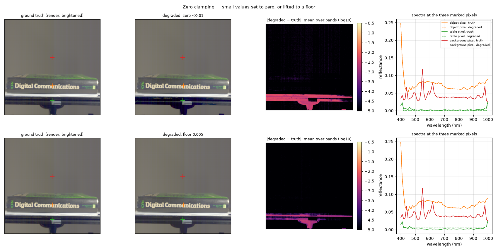
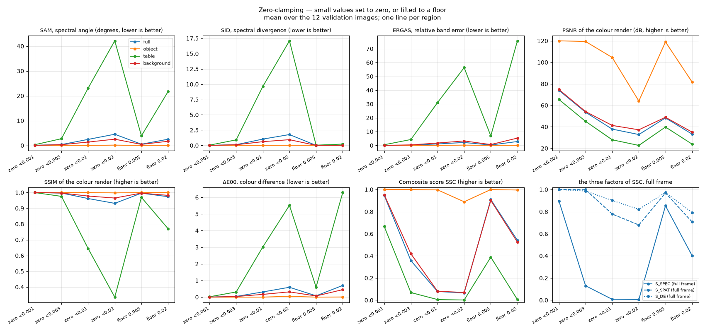

# Zero-clamping and flooring — the trap in the dark

Plan label: M8.

## In one sentence

We set every very small value of a perfect answer to exactly zero — or,
alternatively, lift it to a small floor — and watch one metric explode.

## What we do, simply

The dark parts of the scene, the rail and parts of the background, reflect
almost nothing: values like 0.002. Two things a model or a post-processing
step might do to such values:

- **zero them**: anything below a threshold t becomes exactly 0. This is
  what a clamp to [0, 1] does to outputs that drift slightly negative, and
  it is what a "dead" output channel produces. We try t = 0.001, 0.003,
  0.01, 0.02.
- **floor them**: anything below t becomes t, never 0. This is the
  evaluation-side safeguard August used (t = 0.005). We try t = 0.005 and
  0.02.

To the eye and to the object both are invisible. To one of the metrics they
are opposites.

## What it is meant to show

- How SID, whose formula contains logarithms of the normalised spectrum,
  treats an exact zero. A zero in the prediction where the truth is not
  zero gives log(p/ε) with ε = 10⁻¹², a huge number.
- How to read T2, the clamp ablation: the training-time clamp encourages
  exact zeros in the dark; this experiment prices them.
- Whether flooring predictions at evaluation is safe.

## Exactly how

- "zero < t": x[x < t] = 0.
- "floor t": max(x, t).

## Results

Zeroing below 0.01 (top): the object and the background are untouched (the
difference map is black there), the rail is entirely affected, and its
render turns to blue-grey speckle because bands zeroed unevenly produce a
random colour. The table pixel's dashed spectrum is a flat line at zero.
Flooring at 0.005 (bottom): the same rail pixels are affected — but the
dashed spectrum is a flat line at 0.005, not at 0, and that is the whole
difference.

Mean over the 12 validation images:

| setting | region | SAM ° | SID | ERGAS | PSNR dB | SSIM | ΔE00 | S_spec | S_spat | S_col | **SSC** |
|---|---|---|---|---|---|---|---|---|---|---|---|
| zero <0.001 | full | 0.05 | 0.0062 | 0.02 | 73.9 | 1.0000 | 0.00 | 0.897 | 1.000 | 0.999 | **0.947** |
| zero <0.001 | object | 0.01 | 0.0000 | 0.00 | 120.0 | 1.0000 | 0.00 | 1.000 | 1.000 | 1.000 | **1.000** |
| zero <0.001 | table | 0.30 | 0.0460 | 0.49 | 65.4 | 0.9997 | 0.02 | 0.457 | 1.000 | 0.993 | **0.666** |
| zero <0.001 | background | 0.05 | 0.0054 | 0.05 | 74.7 | 1.0000 | 0.00 | 0.907 | 1.000 | 0.999 | **0.952** |
| zero <0.003 | full | 0.35 | 0.1218 | 0.17 | 53.6 | 0.9966 | 0.04 | 0.130 | 0.998 | 0.986 | **0.357** |
| zero <0.003 | object | 0.01 | 0.0000 | 0.00 | 119.4 | 1.0000 | 0.00 | 0.999 | 1.000 | 1.000 | **1.000** |
| zero <0.003 | table | 2.72 | 0.9078 | 4.27 | 45.1 | 0.9756 | 0.31 | 0.005 | 0.906 | 0.902 | **0.069** |
| zero <0.003 | background | 0.30 | 0.1086 | 0.38 | 54.2 | 0.9968 | 0.04 | 0.195 | 0.998 | 0.988 | **0.419** |
| zero <0.01 | full | 2.43 | 1.0337 | 1.09 | 37.9 | 0.9619 | 0.31 | 0.008 | 0.778 | 0.901 | **0.078** |
| zero <0.01 | object | 0.01 | 0.0002 | 0.01 | 104.5 | 1.0000 | 0.00 | 0.994 | 1.000 | 1.000 | **0.997** |
| zero <0.01 | table | 23.08 | 9.6291 | 30.97 | 27.9 | 0.6447 | 3.02 | 0.000 | 0.454 | 0.367 | **0.006** |
| zero <0.01 | background | 1.37 | 0.6139 | 1.74 | 41.3 | 0.9775 | 0.17 | 0.008 | 0.843 | 0.947 | **0.081** |
| zero <0.02 | full | 4.51 | 1.7744 | 2.12 | 32.8 | 0.9313 | 0.59 | 0.006 | 0.679 | 0.821 | **0.065** |
| zero <0.02 | object | 0.13 | 0.0235 | 0.24 | 64.0 | 0.9976 | 0.05 | 0.864 | 0.961 | 0.984 | **0.889** |
| zero <0.02 | table | 42.14 | 17.0880 | 56.31 | 22.7 | 0.3361 | 5.52 | 0.000 | 0.213 | 0.159 | **0.001** |
| zero <0.02 | background | 2.52 | 0.9384 | 3.22 | 37.2 | 0.9651 | 0.32 | 0.006 | 0.770 | 0.901 | **0.069** |
| floor 0.005 | full | 0.50 | 0.0057 | 0.29 | 48.3 | 0.9959 | 0.08 | 0.852 | 0.969 | 0.974 | **0.909** |
| floor 0.005 | object | 0.01 | 0.0000 | 0.00 | 119.0 | 1.0000 | 0.00 | 0.999 | 1.000 | 1.000 | **1.000** |
| floor 0.005 | table | 3.87 | 0.0411 | 6.92 | 39.8 | 0.9694 | 0.60 | 0.188 | 0.815 | 0.819 | **0.388** |
| floor 0.005 | background | 0.42 | 0.0052 | 0.64 | 48.9 | 0.9964 | 0.07 | 0.832 | 0.978 | 0.977 | **0.902** |
| floor 0.02 | full | 2.50 | 0.0265 | 2.83 | 33.2 | 0.9736 | 0.70 | 0.402 | 0.707 | 0.791 | **0.540** |
| floor 0.02 | object | 0.03 | 0.0001 | 0.05 | 81.6 | 0.9999 | 0.01 | 0.992 | 1.000 | 0.997 | **0.996** |
| floor 0.02 | table | 21.68 | 0.2119 | 75.72 | 23.9 | 0.7707 | 6.29 | 0.000 | 0.450 | 0.123 | **0.005** |
| floor 0.02 | background | 1.68 | 0.0211 | 5.31 | 35.0 | 0.9818 | 0.45 | 0.356 | 0.741 | 0.863 | **0.524** |

## Reading

- **Zeroing below 0.01: object 0.997, full frame 0.078.** A prediction that
  is perfect everywhere except that the darkest 5 % of the frame reads
  exactly zero loses 92 % of its full-frame score. Full-frame SID is 1.03
  (S_SID = 0.000); the rail alone has SID 9.6 and SAM 23°.
- **Even zeroing below 0.003 halves the full-frame score** (0.36): there
  are enough rail pixels between 0.001 and 0.003. Below 0.001 the effect is
  small (0.95) because very few values are that small.
- **Flooring is harmless**: at 0.005 object 1.000, full frame 0.909, and
  no logarithm blows up (full-frame SID 0.006). Even a floor at 0.02, which
  visibly flattens the rail, keeps the full frame at 0.54 — an order of
  magnitude better than zeroing below the same threshold (0.065).
- **The object is immune** to every setting (≥ 0.89): its values are all
  above 0.02, so nothing happens there. This is purely a dark-region effect.

## What to take from it

An exact zero in a prediction is the single most expensive value it can
contain, because of SID's logarithm. A model whose training clamp lets
output channels die at zero in the dark regions is punished on the full
frame regardless of how well it renders the object — and that punishment
is invisible on the object region. Two practical rules follow: floor
predictions at a small positive value before scoring (0.005 costs nothing
on the object and 9 % on the full frame, versus 92 % for zeros), and read
T2 (the clamp ablation) by counting exact zeros per band, not only by its
score.
