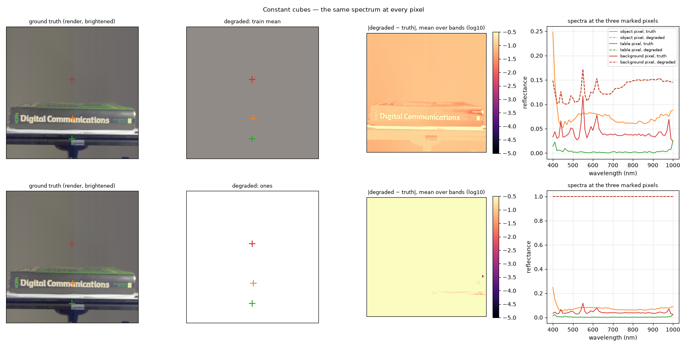
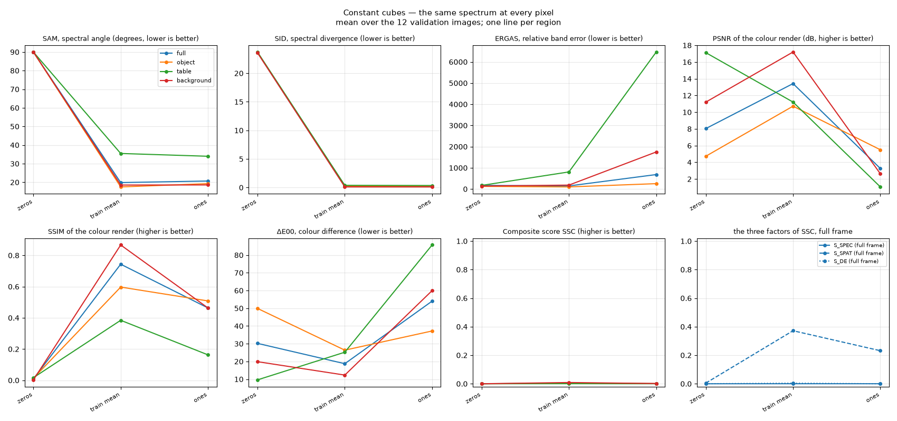

# Constant cubes — the floor, and the Kaggle discrepancy

Plan label: M9.

## In one sentence

We submit the laziest possible answers — the same spectrum at every pixel —
to find the bottom of the scale, and compare with what Kaggle gave for the
same answers.

## What we do, simply

Three "predictions" that contain no information about the image at all:

- **zeros**: every value 0;
- **train mean**: every pixel gets the average spectrum of the whole
  training set — the best constant guess;
- **ones**: every value 1.

Whatever these score is the floor of the scale: any model that does
something must beat it. The organisers' leaderboard was probed with the
same degenerate submissions in August, and gave 0.140 for zeros, 0.140 for
the mean spectrum and 0.091 for ones.

## What it is meant to show

- The floor of the recovered formula.
- Whether the Kaggle leaderboard implements the recovered formula as
  written. If the floors disagree, absolute leaderboard numbers near the
  bottom cannot be compared with local ones.

## Exactly how

- zeros: 0 everywhere; train mean: the 61-band mean over every 8th row of
  all 165 training cubes, broadcast to every pixel; ones: 1 everywhere.

## Results

The renders are a uniform grey (train mean) and pure white (ones); the
spectra are one flat or one average curve for all three marked pixels.

Mean over the 12 validation images:

| setting | region | SAM ° | SID | ERGAS | PSNR dB | SSIM | ΔE00 | S_spec | S_spat | S_col | **SSC** |
|---|---|---|---|---|---|---|---|---|---|---|---|
| zeros | full | 90.00 | 23.6119 | 171.13 | 8.0 | 0.0089 | 30.20 | 0.000 | 0.004 | 0.000 | **0.000** |
| zeros | object | 90.00 | 23.6267 | 125.09 | 4.7 | 0.0130 | 49.93 | 0.000 | 0.007 | 0.000 | **0.000** |
| zeros | table | 90.00 | 23.7186 | 170.45 | 17.1 | 0.0168 | 9.62 | 0.000 | 0.008 | 0.041 | **0.000** |
| zeros | background | 90.00 | 23.5780 | 140.40 | 11.2 | 0.0028 | 19.88 | 0.000 | 0.001 | 0.001 | **0.000** |
| train mean | full | 19.83 | 0.1783 | 146.23 | 13.4 | 0.7434 | 18.74 | 0.000 | 0.372 | 0.004 | **0.004** |
| train mean | object | 17.51 | 0.2083 | 99.86 | 10.7 | 0.5970 | 26.38 | 0.000 | 0.299 | 0.000 | **0.003** |
| train mean | table | 35.48 | 0.3859 | 807.21 | 11.2 | 0.3843 | 25.22 | 0.000 | 0.192 | 0.000 | **0.000** |
| train mean | background | 18.52 | 0.1121 | 185.81 | 17.2 | 0.8667 | 12.32 | 0.000 | 0.433 | 0.017 | **0.009** |
| ones | full | 20.68 | 0.1969 | 682.74 | 3.3 | 0.4633 | 54.04 | 0.000 | 0.232 | 0.000 | **0.001** |
| ones | object | 19.26 | 0.2575 | 253.86 | 5.5 | 0.5082 | 37.20 | 0.000 | 0.254 | 0.000 | **0.002** |
| ones | table | 33.97 | 0.3548 | 6466.55 | 1.1 | 0.1629 | 85.72 | 0.000 | 0.081 | 0.000 | **0.000** |
| ones | background | 18.57 | 0.1089 | 1748.78 | 2.6 | 0.4632 | 59.97 | 0.001 | 0.232 | 0.000 | **0.002** |

## Reading

- **Locally, all three constants score between 0.000 and 0.004** on every
  region. For zeros the mechanism is exact: SAM is 90° for every pixel
  (angle between a spectrum and the zero vector), so S_SAM = exp(−18) is
  clipped to 10⁻⁶; SID is 23.6 (the logarithm of 10¹² is 27.6), so S_SID is
  also 10⁻⁶; ERGAS is 171. The spectral factor is 10⁻⁶ and the composite
  is at most 10⁻³. For the mean spectrum SAM is 20° and ERGAS 146, which
  again pins S_spec at 0.000.
- **Kaggle's 0.140 for a zero cube is impossible under this formula.** With
  the spectral part at 10⁻⁶ no choice of the spatial and colour parts can
  raise the composite above 0.001. The leaderboard therefore does not score
  a zero submission the way the recovered formula does: something in the
  deployment differs — a different handling of failed or non-finite
  metrics, a different pooling or resizing of the cubes, a clipping of the
  submission, or a different aggregation over images. Which one is not
  determined by this experiment.
- **The three constants are ordered differently on Kaggle** (zeros = mean >
  ones) than they are here (mean ≥ ones ≥ zeros, all ≈ 0): the discrepancy
  is not a constant offset.

## What to take from it

The formula's floor is 0; the leaderboard's floor is 0.14. Every local
number in this project is measured with the formula as recovered and
verified against the organisers' own reference code, so *differences*
between our runs are sound. *Absolute* comparisons with leaderboard numbers
near the bottom of the scale are not, and the paper states the deployment
question as open. This is also why the baseline's official 0.239 is treated
as a parity anchor for the training recipe, not as a number to be explained
by the metric study.
